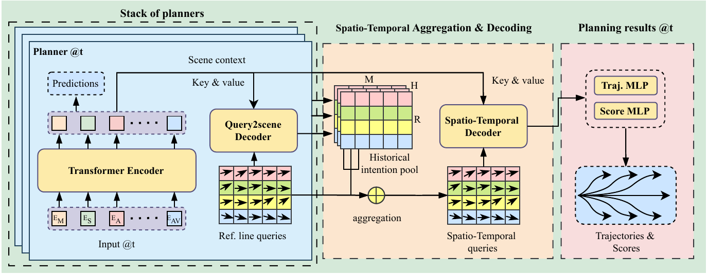

<div align="center">

<h3><span style="color:blue">L</span>ook back the <span style="color:blue">H</span>istory and <span style="color:blue">P</span>lan for the <span style="color:blue">F</span>uture in Autonomous Driving</h3>

[Sheng Wang](https://chantsss.github.io/)<sup>1</sup>, Yao Tian<sup>1</sup>, Xiaodong Mei<sup>1</sup>, Ge Sun<sup>1</sup>, [Jie Cheng](https://jchengai.github.io/)<sup>1</sup>, Fulong Ma<sup>2</sup>, [Pedro V. Sander](https://www.cse.ust.hk/~psander/)<sup>1</sup>, [Junwei Liang†](https://junweiliang.me/)<sup>1,2,†</sup>
†Corresponding authors
 
<sup>1</sup> HKUST, <sup>2</sup> HKUST(GZ)

<a href="https://chantsss.github.io/LHPF/">

</a>
<a href='https://arxiv.org/abs/2411.17253' style='padding-left: 0.5rem;'>
    
</a>



## Demo
<table>
    <tr>
        <td align="center">
            
            <p>Baseline</p>
        </td>
        <td align="center">
            
            <p>LHPF</p>
        </td>
    </tr>
</table>

## News
**`05.12.2024`:** Github repo initialized. <br>
**`27.11.2024`:** Project page released. <br>
**`26.11.2024`:** Paper released on arXiv. <br>
This work is under review, please stay tuned!


## Citation

If you find this repo useful, please consider giving us a star 🌟 and citing our related paper.

```bibtex
@misc{wang2024lhpflookhistoryplan,
      title={LHPF: Look back the History and Plan for the Future in Autonomous Driving}, 
      author={Sheng Wang and Yao Tian and Xiaodong Mei and Ge Sun and Jie Cheng and Fulong Ma and Pedro V. Sander and Junwei Liang},
      year={2024},
      eprint={2411.17253},
      archivePrefix={arXiv},
      primaryClass={cs.RO},
      url={https://arxiv.org/abs/2411.17253}, 
}
```

